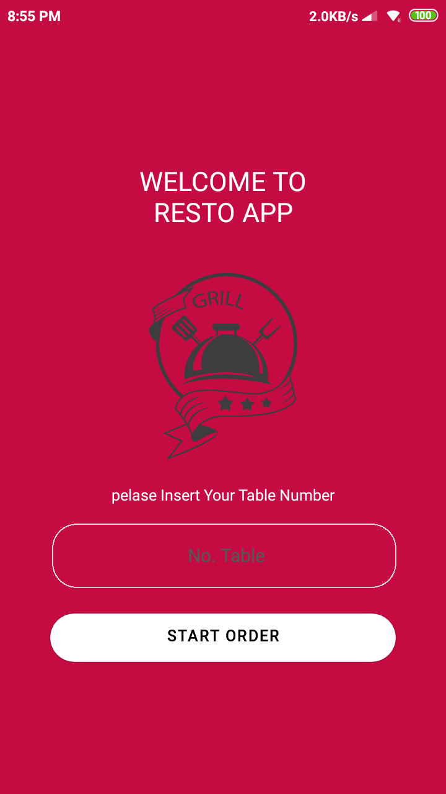
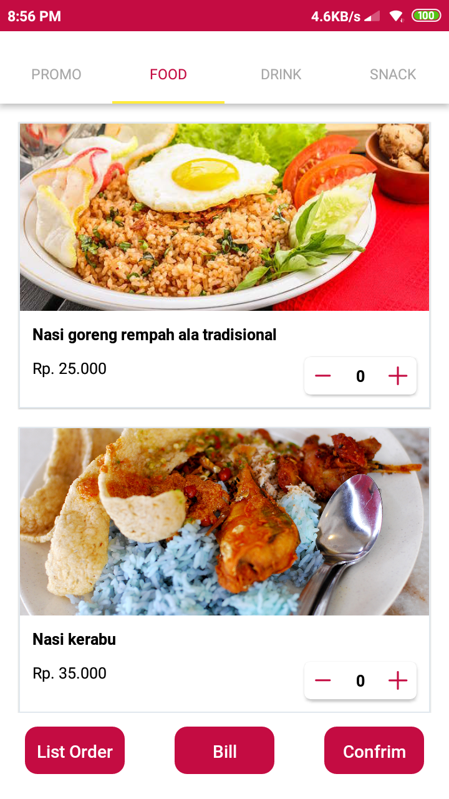

<h1 align="center">
  RESTO APP
</h1>

## Important 

This project is still on very early development stage. If you want to use for production, use it with your own risk.
<br>More feature Coming Really Soon.

## Resto App
Resto App Is an Aplication for User order at Restaurant.

## Screenshots

<p float="left">
  

  

  

  

  
</p>

## Fitures

- Choose Menu
- Promo Detail
- Auto Billing
- Auto Order


## Why Papa Kost

- Esay To Use this Application
- It's React Native, so it support android & iOS by default
- Express is one of the most starred javascript framework, and it is very easy to use

## Tech Stack

- React Native for the Mobile Frontend
- Node + Express Js for the Backend

## Prerequisites

- Make sure You had been install NodeJs in your system [https://nodejs.org/](https://nodejs.org/)
- Then install React Native [https://facebook.github.io/react-native/](https://facebook.github.io/react-native/)
- Dont forget express ad the backend [https://expressjs.com/](https://expressjs.com/)

## Installation & Configuration

follow these steps to install

### Frontend

```bash
git clone https://github.com/taufiekm/restoapp
cd papakost
npm install
npm start
react-native run-ios #for ios
react-native run-android #for android
```


### Backend

```bash
https://github.com/taufiekm/APIrestoapp
cd APIrestoapp
npm install
npm install nodemon -D
npm start
```

### Support Us :)

- Stars this repository
- Hire Us

  * [Taufiek Maulana](https://www.linkedin.com/in/taufiek-maulana-30ba74137/)

  ## Contact

- WA/TELEGRAM: +62 85703018642 (Taufiek Maulana)

## Download App (Demo usage only)
